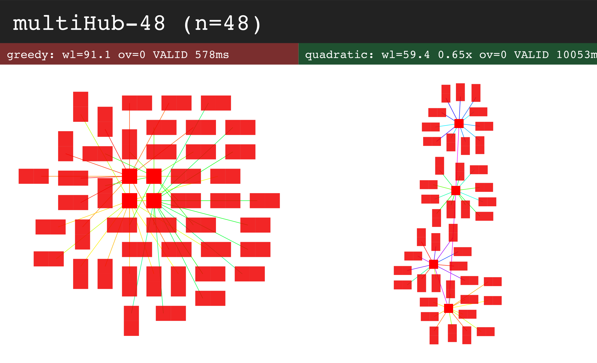
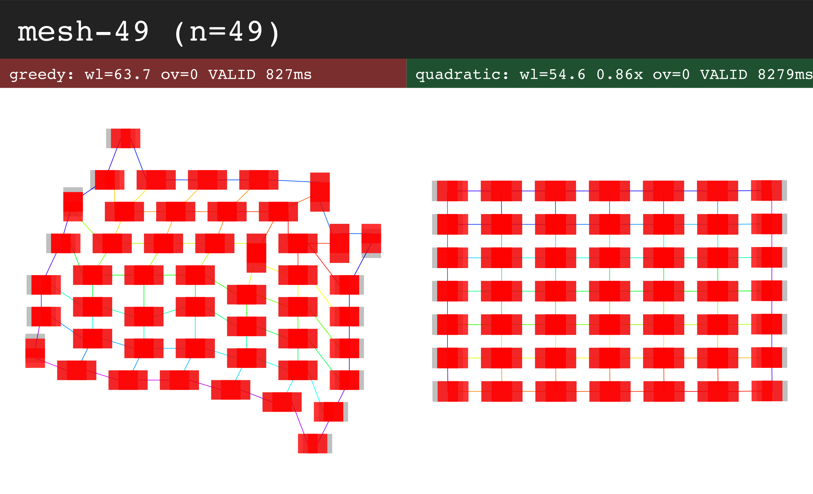
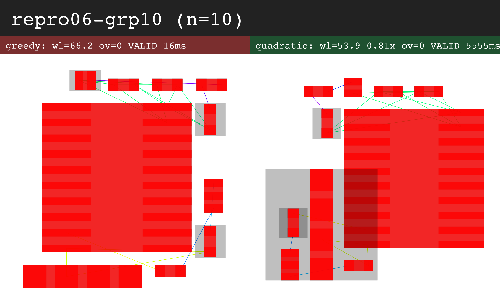
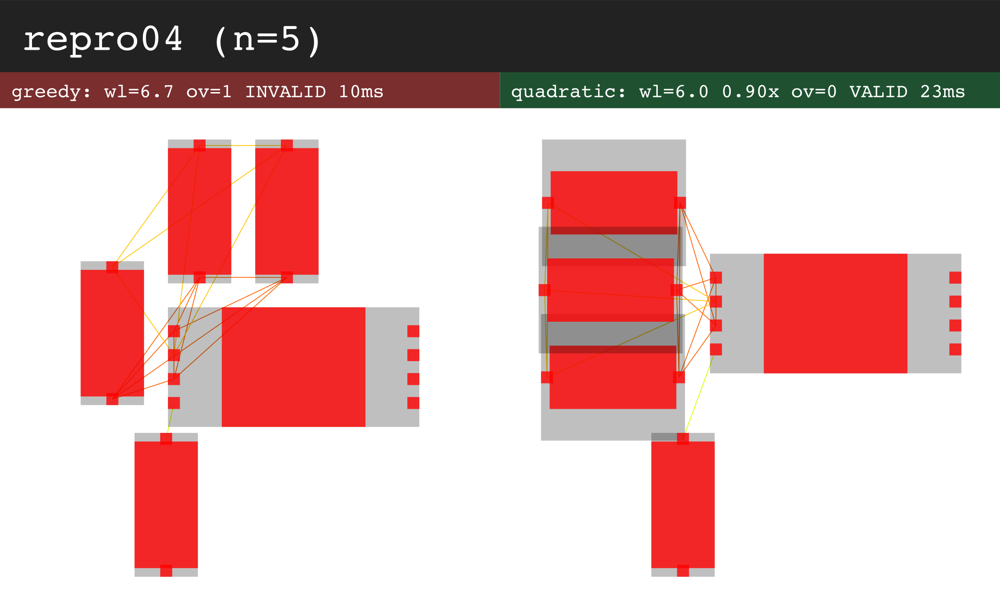
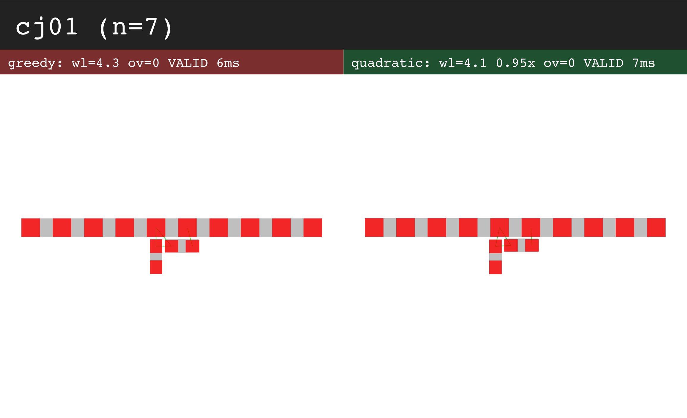
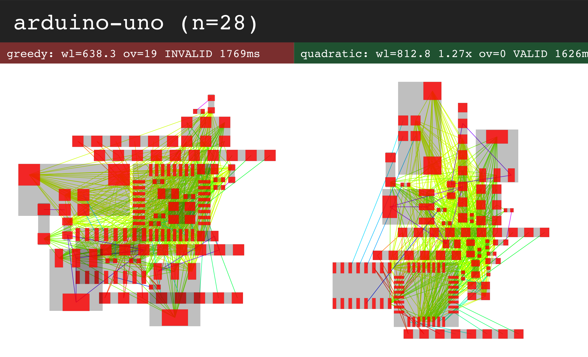
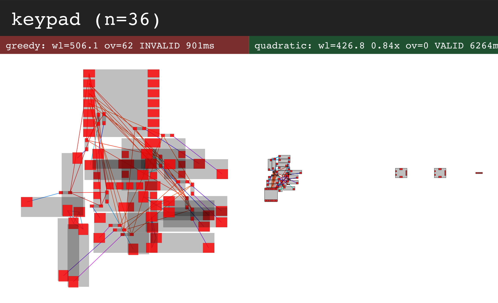
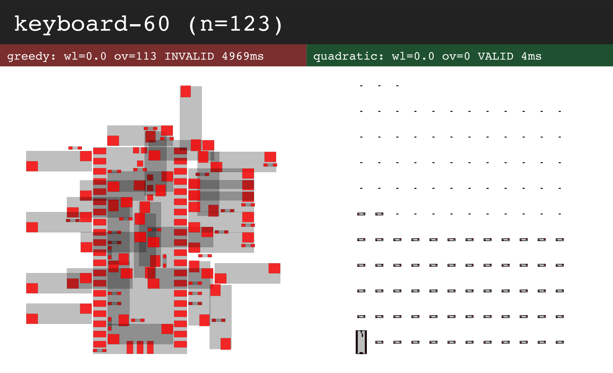
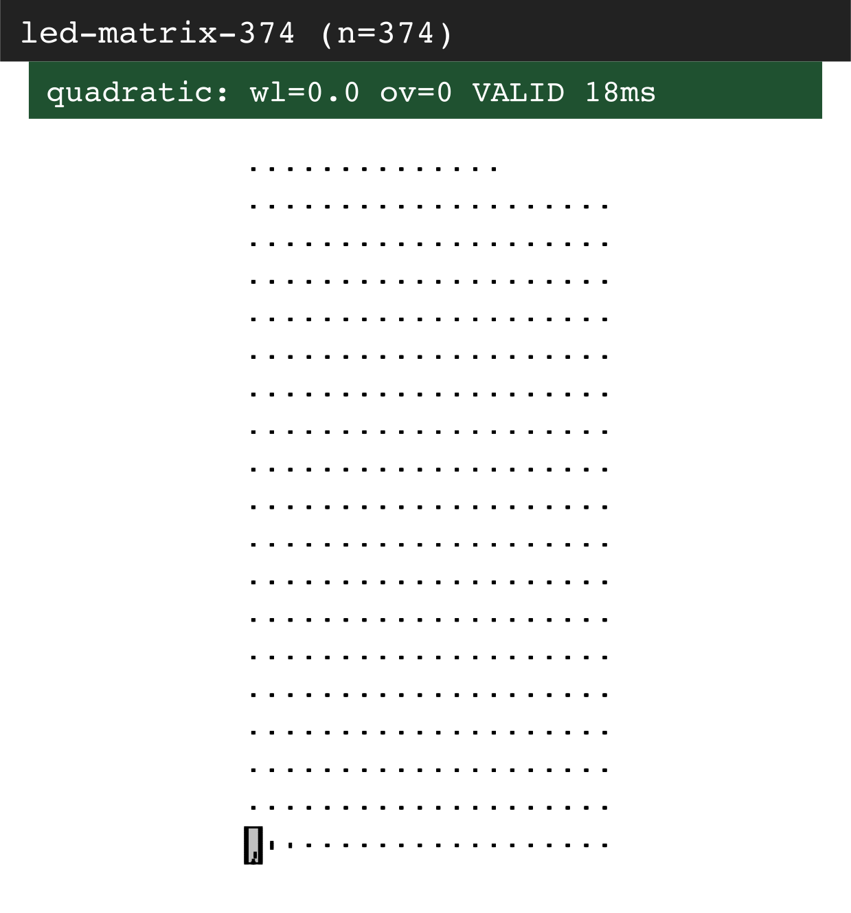

# greedy vs analytical-quadratic - visual comparison

Left = greedy outline packer, right = quadratic (QUALITY preset). Rects are pad/component collision boxes; thin lines are nets (colored per net); dashed blue = board bounds.

### multiHub-48 (n=48)
- greedy: wl=91.1 ov=0 VALID 578ms
- quadratic: wl=59.4 0.65x ov=0 VALID 10053ms

### mesh-49 (n=49)
- greedy: wl=63.7 ov=0 VALID 827ms
- quadratic: wl=54.6 0.86x ov=0 VALID 8279ms

### repro06-grp10 (n=10)
- greedy: wl=66.2 ov=0 VALID 16ms
- quadratic: wl=53.9 0.81x ov=0 VALID 5555ms

### repro04 (n=5)
- greedy: wl=6.7 ov=1 INVALID 10ms
- quadratic: wl=6.0 0.90x ov=0 VALID 23ms

### cj01 (n=7)
- greedy: wl=4.3 ov=0 VALID 6ms
- quadratic: wl=4.1 0.95x ov=0 VALID 7ms

### arduino-uno (n=28)
- greedy: wl=638.3 ov=19 INVALID 1769ms
- quadratic: wl=812.8 1.27x ov=0 VALID 1626ms

### keypad (n=36)
- greedy: wl=506.1 ov=62 INVALID 901ms
- quadratic: wl=426.8 0.84x ov=0 VALID 6264ms

### keyboard-60 (n=123)
- greedy: wl=0.0 ov=113 INVALID 4969ms
- quadratic: wl=0.0 ov=0 VALID 4ms

### led-matrix-374 (n=374)
- quadratic: wl=0.0 ov=0 VALID 18ms

