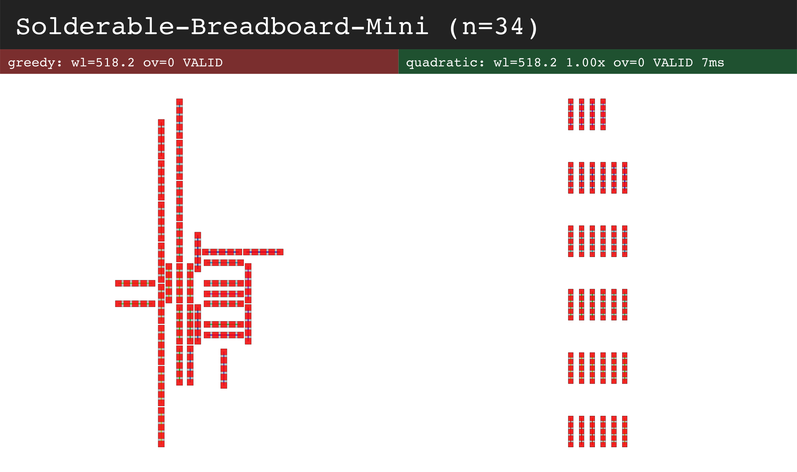
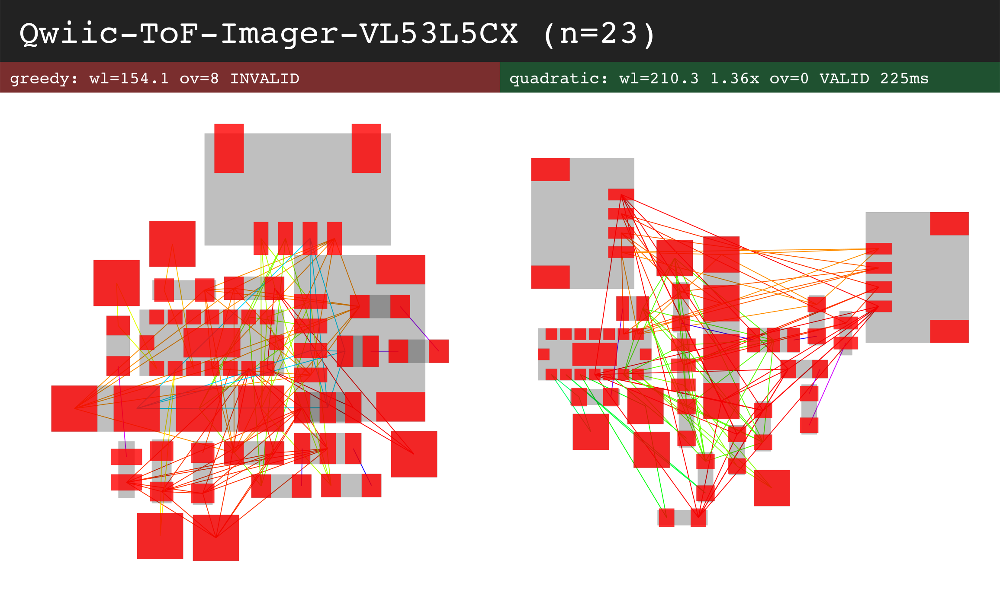
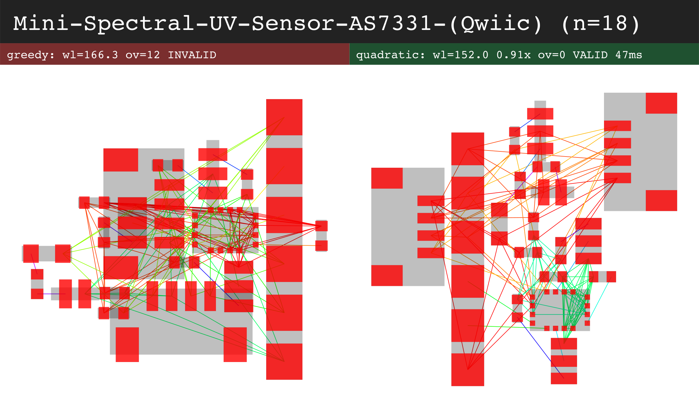
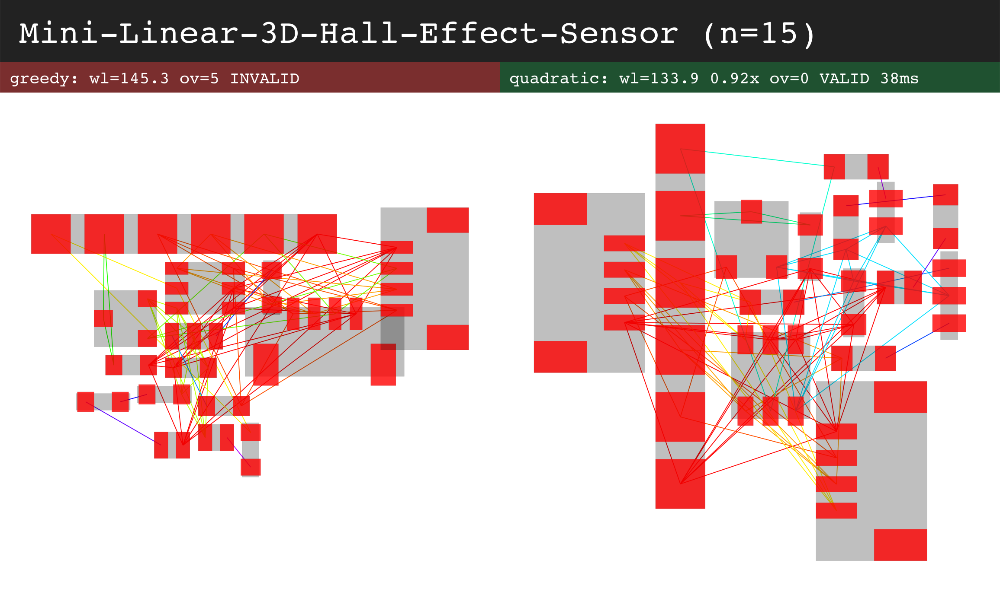
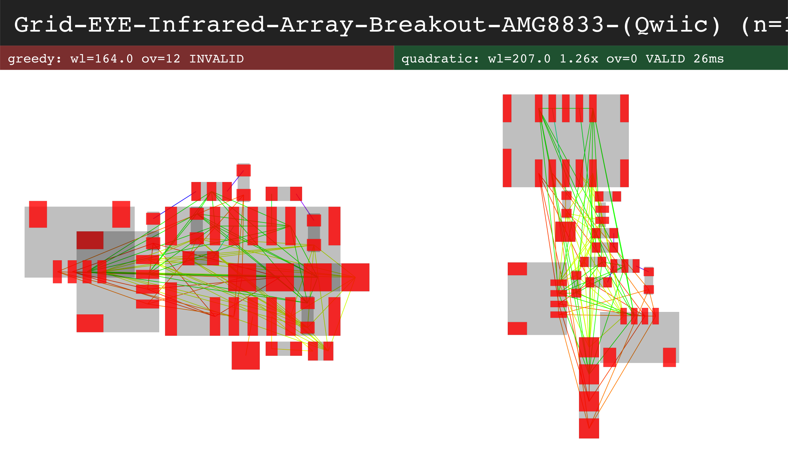
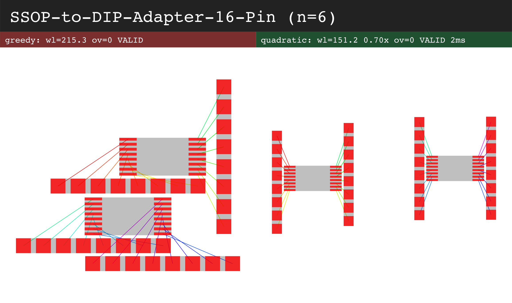
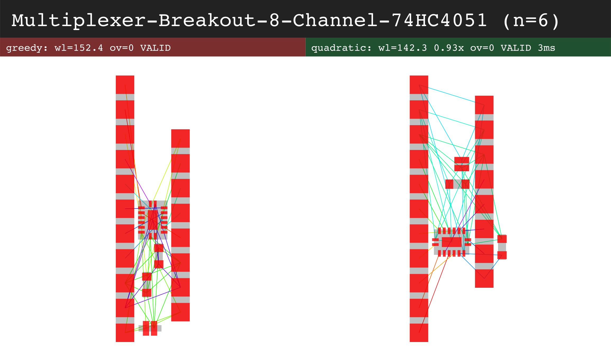
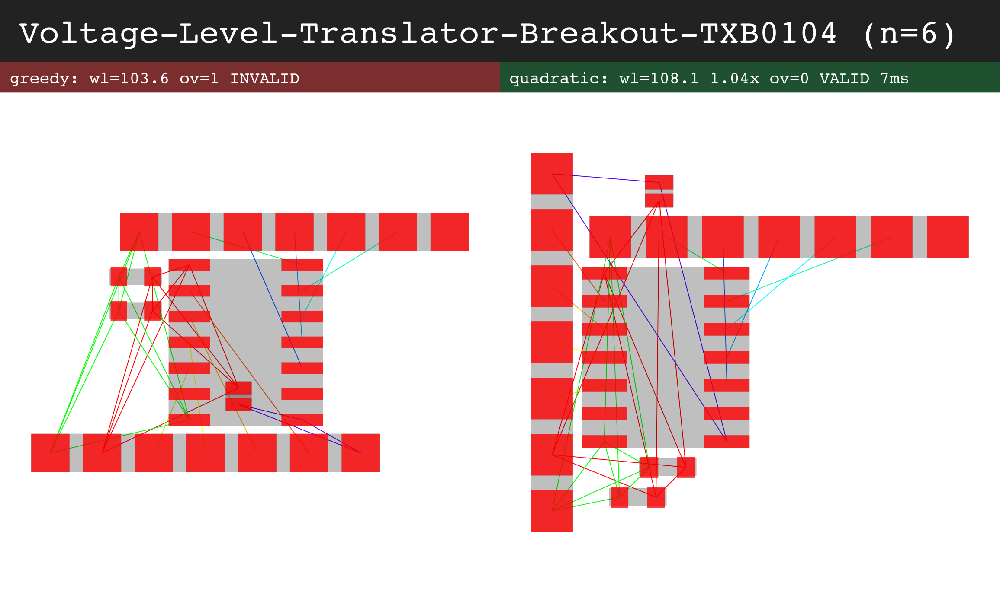
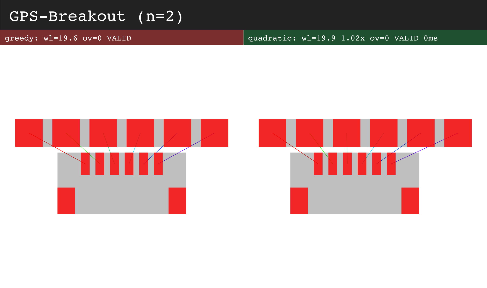
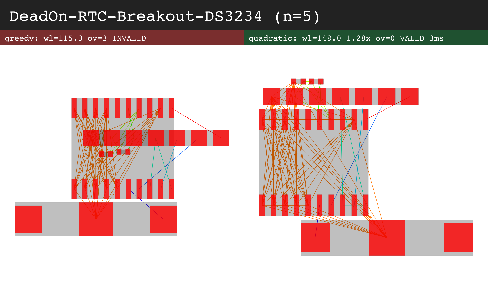

# Real SparkFun boards: greedy vs analytical-quadratic

Boards from [tscircuit/sparkfun-boards](https://github.com/tscircuit/sparkfun-boards), rendered to circuit-json and minted to a faithful PackInput (one component per pcb_component). Left = greedy, right = quadratic. `ov` = component-AABB overlaps (the validatePackedLayout gate); greedy commonly interlocks AABBs (gate-invalid) on real boards while quadratic stays clean.

### Solderable-Breadboard-Mini (n=34)
- greedy: wl=518.2 ov=0 VALID
- quadratic: wl=518.2 1.00x ov=0 VALID 7ms

### Qwiic-ToF-Imager-VL53L5CX (n=23)
- greedy: wl=154.1 ov=8 INVALID
- quadratic: wl=210.3 1.36x ov=0 VALID 225ms

### Mini-Spectral-UV-Sensor-AS7331-(Qwiic) (n=18)
- greedy: wl=166.3 ov=12 INVALID
- quadratic: wl=152.0 0.91x ov=0 VALID 47ms

### Mini-Linear-3D-Hall-Effect-Sensor (n=15)
- greedy: wl=145.3 ov=5 INVALID
- quadratic: wl=133.9 0.92x ov=0 VALID 38ms

### Grid-EYE-Infrared-Array-Breakout-AMG8833-(Qwiic) (n=15)
- greedy: wl=164.0 ov=12 INVALID
- quadratic: wl=207.0 1.26x ov=0 VALID 26ms

### SSOP-to-DIP-Adapter-16-Pin (n=6)
- greedy: wl=215.3 ov=0 VALID
- quadratic: wl=151.2 0.70x ov=0 VALID 2ms

### Multiplexer-Breakout-8-Channel-74HC4051 (n=6)
- greedy: wl=152.4 ov=0 VALID
- quadratic: wl=142.3 0.93x ov=0 VALID 3ms

### Voltage-Level-Translator-Breakout-TXB0104 (n=6)
- greedy: wl=103.6 ov=1 INVALID
- quadratic: wl=108.1 1.04x ov=0 VALID 7ms

### GPS-Breakout (n=2)
- greedy: wl=19.6 ov=0 VALID
- quadratic: wl=19.9 1.02x ov=0 VALID 0ms

### DeadOn-RTC-Breakout-DS3234 (n=5)
- greedy: wl=115.3 ov=3 INVALID
- quadratic: wl=148.0 1.28x ov=0 VALID 3ms

